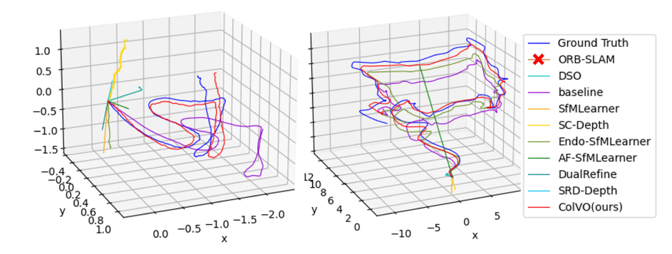
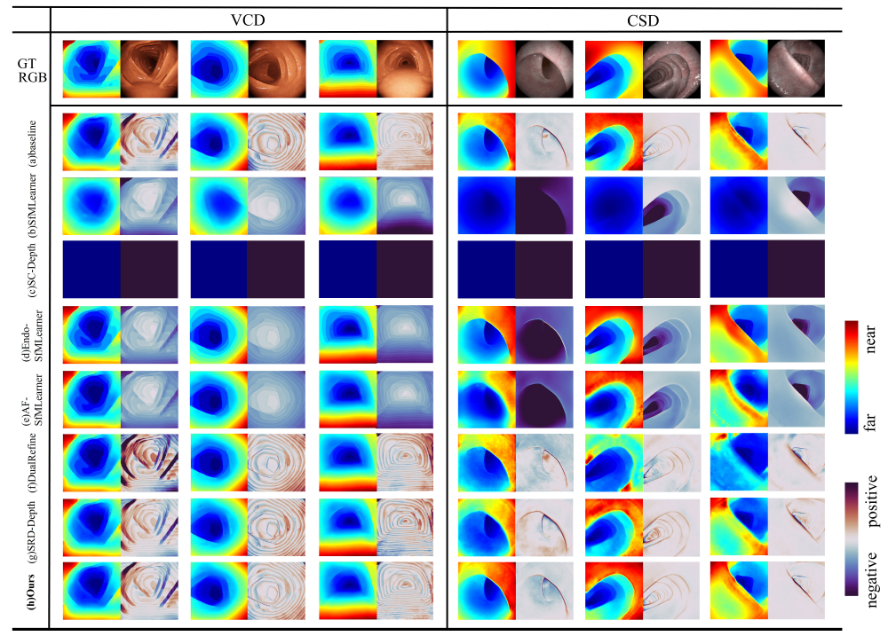
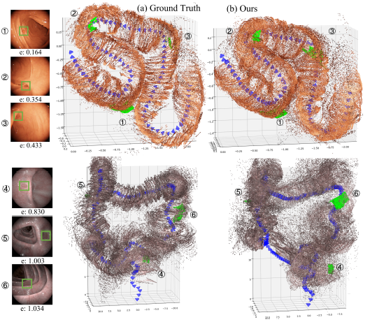

# ColVO: Colonoscopic Visual Odometry Considering Geometric and Photometric Consistency

## Introduction

ColVO is an open-source project dedicated to  estimating colon depth and colonoscopic pose. The primary algorithms utilized two key components: a deep couple strategy for depth and pose estimation (DCDP) and a light consistent calibration mechanism (LCC).

DCDP utilization of multimodal fusion and loss function constraints to couple depth and pose estimation modes ensures seamless alignment of geometric projections between consecutive frames. Meanwhile, LCC accounts for brightness variations by recalibrating the luminosity values of adjacent frames, enhancing ColVO’s robustness.

We also demonstrate two valuable applications: immediate polyp localization and complete 3D reconstruction of the intestine. 

## Dataset

The download link for the dataset is below: Link: https://pan.baidu.com/s/1Zi15B1ucp2zoZjwWmU8zZw Code：o1k2

## Model

The download link for the model is below: Link: https://pan.baidu.com/s/1Eam0aV8NYEKpzlvvDgUsJA Code：quyk

## Experiments

A comprehensive evaluation of ColVO on colon odometry benchmarks reveals its superiority in depth and pose estimation. The trajectory predictions of ColVO are close to the ground truth and exhibit less drift or jitter compared to other methods.

The qualitative results of the depth estimation comparison with the SoTA methods are shown below.

To demonstrate the effectiveness of  ColVO, we also implemented a 3D colon reconstruction visualization by stitching together the dense depth maps of each frame using the colonoscopic trajectory. Here is the 3D colon reconstruction visualization.

